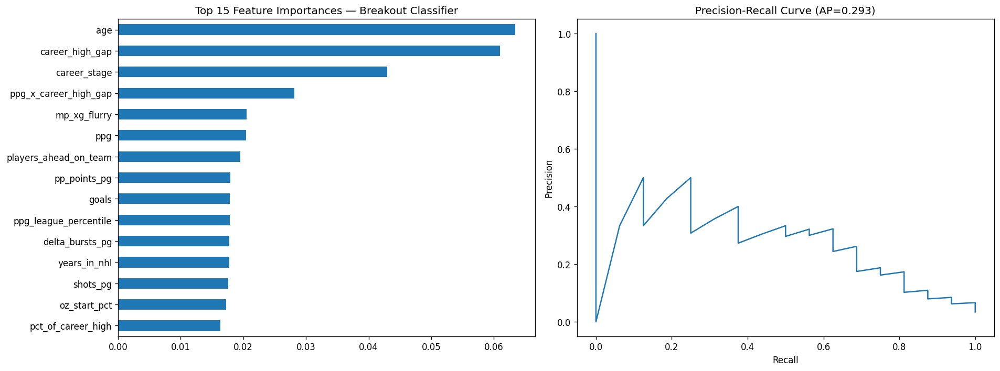
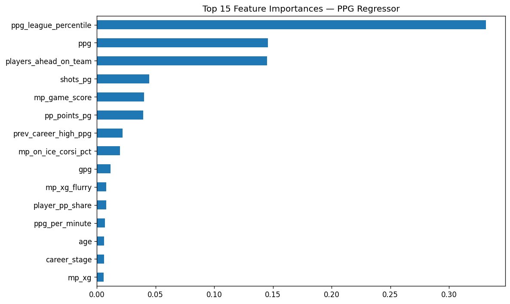

# NHL Player Performance Prediction

End-to-end ML pipeline that pulls 16 seasons of NHL data from four data sources — three NHL APIs plus MoneyPuck's xG-based shot quality dataset — engineers 80+ player and team features, and trains two models:

- **PPG Regressor** (XGBoost) — predicts a skater's points-per-game next season
- **Breakout Classifier** (XGBoost, with optional Logistic / ElasticNet variant) — flags players poised for a career-best leap

Built to be reproducible from a fresh clone: data is committed, training runs in under a minute on a laptop.

---

## Headline Results

Evaluated on the **2024–25 NHL season** (468 player-seasons), trained on all prior seasons back to 2010–11. The breakout classifier is also validated by **rolling-origin cross-validation** across the last 3 seasons (1,428 player-seasons, 54 breakouts) to confirm that single-season metrics aren't overfit.

### Breakout Classifier — XGBoost (current production config)
| Metric | Single-season (2024-25) | CV-pooled (22-23 / 23-24 / 24-25) |
|---|---|---|
| ROC-AUC | 0.897 | 0.865 |
| Average Precision | 0.293 | **0.238** |
| Recall @ threshold 0.40 | 10 / 16 (62%) | 25 / 54 (46%) |
| Precision @ threshold 0.40 | 10 / 32 (31%) | 25 / 88 (28%) |
| Brier Score | 0.039 | 0.041 |

A "breakout" is defined as a season where a player both exceeds their prior career-high PPG by at least 0.15 *and* clears a 0.45 PPG floor (~37 points over 82 games). 16 such seasons occurred in 2024-25; the model flagged 10 of them in its 32 highest-probability predictions.

> **Honesty note on CV:** earlier runs of an ElasticNet logistic model hit AP 0.41 on a single test season (see Run #14 in the leaderboard). Adding cross-validation revealed that pooled AP collapsed to 0.20 — the headline number was largely test-season luck. The XGB model is now the production recommendation because it's stable across folds (per-fold APs 0.27 / 0.28 / 0.29). This kind of finding is the reason CV exists.



### PPG Regressor
| Metric | Value |
|---|---|
| RMSE | 0.137 |
| MAE | 0.107 (PPG units, ~8 points / 82 games) |
| R² | 0.796 |
| Train R² | 0.779 (no overfitting) |

Defensemen MAE: 0.098 · Forwards MAE: 0.111 — model handles both positions cleanly without separate heads.



See [`LEADERBOARD_BREAKOUT.md`](LEADERBOARD_BREAKOUT.md) for the full run history (26+ experiments including the MoneyPuck integration) and [`HYPERPARAMETERS.md`](HYPERPARAMETERS.md) for tuning details.

---

## Sample Predictions

A few highlights from the 2024-25 test set ([full CSV](assets/sample_predictions_ppg.csv)):

| Player | Actual PPG | Predicted | Error |
|---|---|---|---|
| Nikita Kucherov | 1.71 | 1.37 | −0.34 |
| Auston Matthews | 0.88 | 1.21 | +0.33 |
| Elias Pettersson | 0.69 | 0.82 | +0.13 |
| Leo Carlsson | 0.96 | 0.63 | −0.33 |
| Lucas Raymond | 0.95 | 0.95 | +0.00 |

Top breakout-probability predictions for 2024-25 ([full CSV](assets/sample_predictions_breakout.csv)) — bold = actual breakout:

| Rank | Player | Breakout Prob | Actual |
|---|---|---|---|
| 1 | Marco Kasper | 0.92 | — |
| 2 | Cole Sillinger | 0.86 | — |
| 3 | **Will Smith** | 0.85 | ✓ |
| 4 | **Cutter Gauthier** | 0.85 | ✓ |
| 5 | Adam Fantilli | 0.81 | — |
| 6 | Quinton Byfield | 0.74 | — |
| 7 | **Zach Benson** | 0.73 | ✓ |
| 8 | **Matt Boldy** | 0.72 | ✓ |

---

## Quickstart

```bash
git clone https://github.com/omastey/hockey_point_prediction.git
cd hockey_point_prediction

python3 -m venv .venv && source .venv/bin/activate
pip install -r requirements.txt

# Train the PPG regressor (~15s)
python -m src.train_xgb

# Train the breakout classifier (XGB, default config)
python -m src.train_breakout

# Honest cross-validated evaluation (3 folds, ~30s)
python -m src.train_breakout --cv
```

Data is already committed (`data/*.parquet`, `data/moneypuck/*.csv`), so no API calls are needed to reproduce results.

Useful flags:

```bash
# Headless / CI — save plot to file, skip display
python -m src.train_breakout --no-plot --save-plot assets/breakout.png

# Run hyperparameter CV before training (logistic only)
python -m src.train_breakout --model logistic --tune

# Different test season
python -m src.train_breakout --test-season 20232024

# XGBoost with probability calibration (sigmoid / isotonic)
python -m src.train_breakout --calibrate sigmoid
```

---

## How It Works

```
NHL APIs                            feature engineering        models
─────────                           ───────────────────        ──────
Landing API ────┐
Edge API ───────┤                                        ┌──→ XGB Regressor (PPG)
                ├─→ merge on (playerId, season) + ──→  80+ feats
Stats API ──────┤      (team, season)                    └──→ XGB Classifier (breakout)
MoneyPuck CSVs ─┘                                                  + Logistic / ElasticNet variant
```

1. **Fetch** — `get_all_player_profiles.py`, `get_all_edge_stats.py`, `get_team_stats.py` pull from the NHL's Landing, Edge, and Stats APIs respectively. `load_moneypuck_stats.py` reads MoneyPuck's xG and shot-quality CSVs (manually downloaded, license-gated).
2. **Merge** — `merge_datasets.py` joins profile data (16 seasons, primary) with Edge tracking (2021-22+, left-joined), team context, and MoneyPuck xG stats (2008-09+, left-joined). XGBoost handles the NaNs from partial coverage natively.
3. **Engineer** — `feature_engineering.py` computes 80+ features: per-game rates, percentile ranks, career trajectory deltas (Δ TOI, Δ PPG), interaction terms (`ppg × career_high_gap`), team context (PP opportunity, faceoff share), roster depth (`players_ahead_on_team`), and **MoneyPuck-derived xG signals** (`xg_luck` = goals − expected goals, `oz_start_pct`, `xg_per_60`, `xg_high_danger_per_60`).
4. **Train** — strict temporal split (train on all seasons before test season). XGB models use `eval_metric="aucpr"` and `scale_pos_weight` for the rare-positive breakout task. Logistic variant uses ElasticNet for sparse feature selection. Both support sigmoid / isotonic calibration via `CalibratedClassifierCV`.
5. **Evaluate** — TP/FP/FN at threshold, ROC-AUC, Average Precision, Brier score, Precision@K, lift, and per-position / per-tier MAE breakdowns. The `--cv` flag runs rolling-origin cross-validation across the last 3 seasons and pools predictions — much harder for a model to look better than it is.

For the full feature catalogue with formulas and rationale, see [`FEATURES.md`](FEATURES.md). For decisions about removed features (and why), see [`src/archived_features.py`](src/archived_features.py).

---

## Tech Stack

- **Python 3.11** · pandas · NumPy
- **XGBoost** 2.x — regressor + classifier (primary models)
- **scikit-learn** — LogisticRegression (ElasticNet), CalibratedClassifierCV, time-series CV
- **matplotlib** — feature-importance bars, precision-recall curves
- **Parquet (pyarrow)** — efficient on-disk dataset storage
- **Data sources** — NHL Landing API, NHL Edge tracking, NHL Stats API, [MoneyPuck](https://moneypuck.com/data.htm) xG dataset

---

## Project Structure

```
src/                          Pipeline code (run as modules: python -m src.X)
  constants.py                Season list, edge-season cutoff, filters
  feature_engineering.py      80+ engineered features (per-game, deltas, interactions, xG)
  tuning.py                   Time-series CV hyperparameter search
  archived_features.py        Removed features with rationale
  data.py                     Merge utilities (profile-primary, edge / MoneyPuck left-joined)

  get_all_player_profiles.py  NHL Landing API → player season stats
  get_all_edge_stats.py       NHL Edge API → puck/skating tracking
  get_team_stats.py           NHL Stats API → team PP / faceoff context
  load_moneypuck_stats.py     MoneyPuck CSVs → xG / shot-quality parquet
  merge_datasets.py           Combines all four sources into final training set

  train_xgb.py                PPG regressor (XGBoost)
  train_breakout.py           Breakout classifier (XGB / logistic), supports --cv

data/                         Committed parquet datasets + MoneyPuck CSVs (no API calls needed)
models/                       Saved model artifacts (.joblib)
assets/                       Plots + sample predictions used in this README
scripts/                      One-off debug utilities
```

---

## Documentation

| Doc | What's in it |
|---|---|
| [`FEATURES.md`](FEATURES.md) | All 80+ features grouped by source (Landing / Edge / Team / MoneyPuck / Derived), with formulas and rationale |
| [`HYPERPARAMETERS.md`](HYPERPARAMETERS.md) | Hyperparameter tuning runs, CV configurations, calibration experiments |
| [`LEADERBOARD_BREAKOUT.md`](LEADERBOARD_BREAKOUT.md) | Chronological log of 26+ breakout-classifier experiments — what was tried, what worked, what regressed |
| [`LEADERBOARD_PPG.md`](LEADERBOARD_PPG.md) | PPG regressor runs (currently one tracked baseline + prior code-history context) |
| [`.claude/CLAUDE.md`](.claude/CLAUDE.md) | Developer workflow notes (data pipeline commands, conventions for adding features) |
